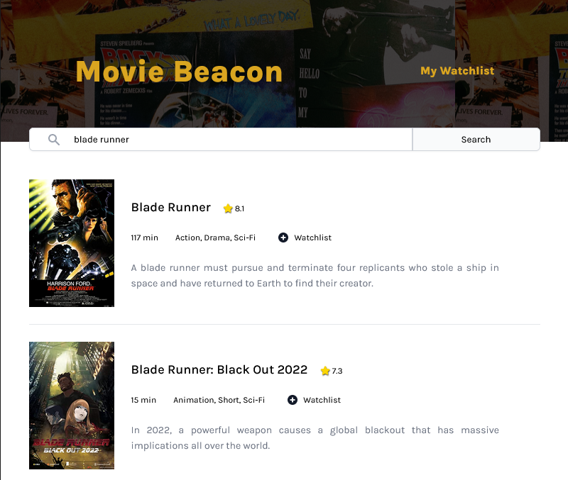

# Movie Watchlist App

## This is a solution to the Movie Watchlist solo project from Scrimba

<div align="center">
    
</div>

## Overview

The challenge consisted in:

-   Making API calls to the OMBd API to get movie data by name.
-   Rendering to the DOM the movies searched.
-   Give the user the ability to store movies to the watchlist using localStorage.
-   Fetching the stored movies from localStorage and render them to the DOM.
-   Give the user the ability to remove movies from the watchlist.

## Elaboration

### This project was built using:

-   Vite
-   HTML markup
-   Vanilla JavaScript
-   CSS
-   Fetch API

## Quick start:

To run this project you will need to install:

-   git:
    -   After installing the package run in ths terminal the command `git --version`, if the installation was successful the ouput should look liks this: `git version x.xx.x.windows.x`. Download [here](https://git-scm.com/).
-   Node.js:
    -   After the installation run the command `node --version`, if the ouput looks like `vxx.xx.x` it means the installation was successful. Download [here](https://nodejs.org/en/).

Initialize git, clone the repo and cd into the folder:

```
$ git init
$ git clone
$ cd ordering-app
```

To install the dependencies run:

```
$ yarn # npm install
```

### Development

After installing all dependencies run dev mode to continually compile the JavaScript as you work:

```
$ yarn dev # npm run dev
$ yarn build # npm run build
```

## Resources

-   Head over to https://vitejs.dev/ to learn more about using vite
-   Using the [Fetch API](https://developer.mozilla.org/en-US/docs/Web/API/Fetch_API/Using_Fetch)
-   Window.localStorage(https://developer.mozilla.org/en-US/docs/Web/API/Window/localStorage)
-   JSON.stringify(https://developer.mozilla.org/en-US/docs/Web/JavaScript/Reference/Global_Objects/JSON/stringify)
-   JSON.parse(https://developer.mozilla.org/en-US/docs/Web/JavaScript/Reference/Global_Objects/JSON/parse)

## Outro ⭐️

I hope it ends up being useful to you, and if you want to contribute, PRs are welcome. 👩🏻‍💻 🎉 👨🏻‍💻 🎉
